# CLAP Desktop User Guide

A walkthrough of how to actually use the app, with screenshots from a live session. If you haven't installed it yet, see the [README](../README.md) for install steps.

---

## Contents

1. [What CLAP Desktop is](#what-clap-desktop-is)
2. [Quick start (one minute)](#quick-start)
3. [The mental model](#the-mental-model)
4. [Step-by-step walkthrough](#walkthrough)
   - [4.1 Pick a data directory and create a profile](#41-data-dir-and-profile)
   - [4.2 Load the CLAP model](#42-load-the-clap-model)
   - [4.3 Create a session](#43-create-a-session)
   - [4.4 Run a detection experiment](#44-run-a-detection-experiment)
   - [4.5 Read the spectrogram](#45-read-the-spectrogram)
   - [4.6 Annotate and verify detections](#46-annotate-and-verify-detections)
   - [4.7 Compare experiments (multi-overlay)](#47-compare-experiments)
5. [Settings reference](#settings-reference)
6. [Tips, gotchas, and limits](#tips-and-gotchas)
7. [Troubleshooting](#troubleshooting)

---

## What CLAP Desktop is

CLAP Desktop is a tool for **prompt-driven detection** of sounds in audio recordings. It's built for bioacoustics work where you want to find every plausible whale call, bird vocalization, or any other event you can describe in plain English, without having to train or fine-tune a model first.

You give it a couple of short text prompts (a positive one like "whale song; humpback vocalization" and a negative one like "engine noise; static"), and it returns time-stamped detections with confidence scores. You review them, refine the bounds, label species, and verify. All of that lives on disk as CSV files you can hand off to whatever you're doing next.

Everything runs locally. Your audio never leaves the machine.

---

## Quick start

The whole loop, end to end:

1. **Launch the app** from the Start Menu (Windows) or Applications folder (Mac).
2. **First-time setup.** Pick a data directory (any folder on disk), then create a profile inside it. Both happen from the buttons in the top-right of the header.
3. **Load the model.** Click the red `CLAP Not Loaded` button in the header and pick `CLAP_Jan23`. Wait until it turns blue.
4. **Create a session.** Click `Create Session`, browse to a folder of `.wav` files, pick some, and hit `Create Session`.
5. **Run a detection.** Open the new session, click `New Experiment`, type a positive prompt (e.g. `baby cry`), a negative prompt (e.g. `noise`), pick a threshold, and click `Run Detection`.
6. **Review.** Click any detection rectangle on the spectrogram to annotate or verify it.

Once you've done it once, you'll have the shape of the workflow. Everything below is the long version.

---

## The mental model

There are five nested concepts. They also happen to map directly to how your work is stored on disk, in case you want to back it up or share it:

```
<data_dir>/
└── <profile>/
    └── <session_id>/
        ├── config.json
        └── <experiment_id>.csv
```

- **Data directory.** The root folder where everything lives. Pick this once per machine.
- **Profile.** A workspace under the data directory. Use one per project, or one per teammate.
- **Session.** A batch of audio files you want to analyze together.
- **Experiment.** One configuration (positive prompt, negative prompt, threshold) applied to a session, producing a set of detections. A session can hold many experiments.
- **Detection.** A single row inside an experiment's CSV, identifying one event in one file.

You always work inside one session at a time, and within that session you flip between experiments using the sidebar.

---

## Walkthrough

The screenshots below come from a live run against the bundled CLAP_Jan23 model and two short demo WAVs.

### 4.1 Data dir and profile

When the app first opens, you see the Sessions screen. Until you've picked a data directory and an active profile, the *Create Session* button is greyed out and the body says *"You must select a data directory and a profile to view sessions."*

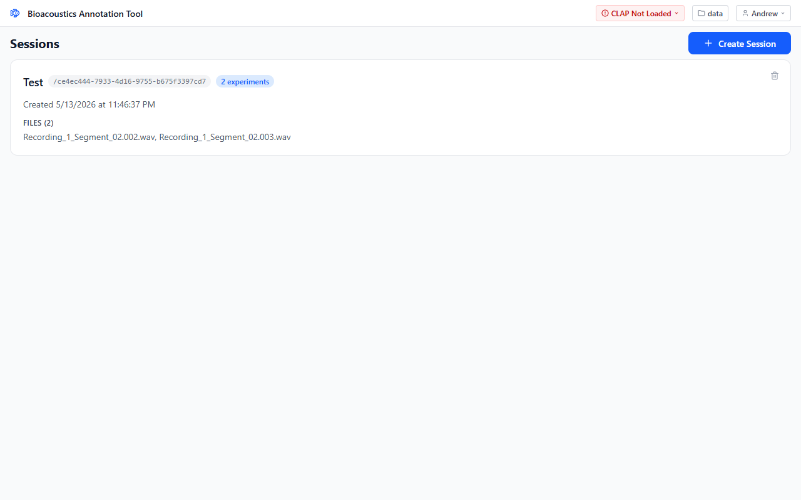

Use the header buttons on the right side:

- The **folder button** (showing your data dir name) opens a native folder picker. Pick the parent directory where all your work will live.
- The **profile button** next to it opens a dropdown of profiles found under that directory.

Click the profile button to see existing profiles and a *Create Profile* shortcut:

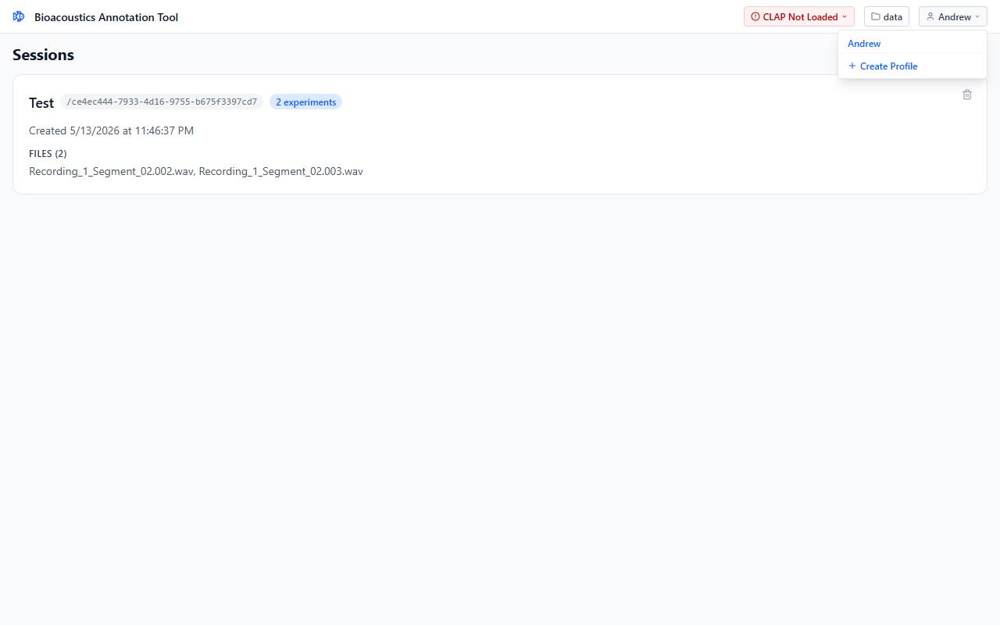

Clicking *Create Profile* opens this modal:

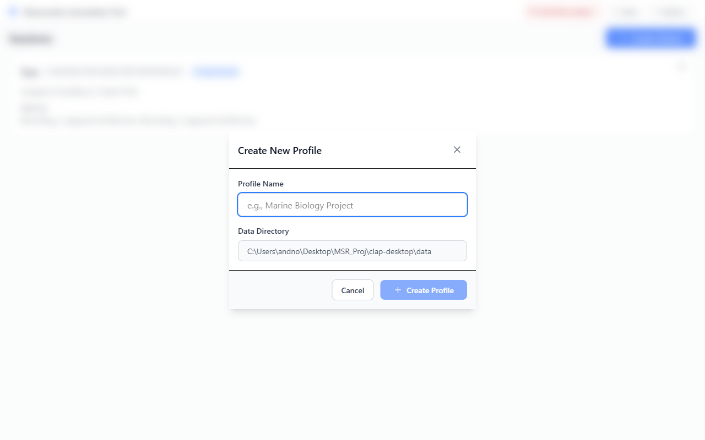

The data directory is shown read-only so you know exactly where the profile will be created. The name field checks as you type. If you use any of the characters `/ \ : * ? " < > |`, the field turns red and *Create Profile* disables until you fix it:

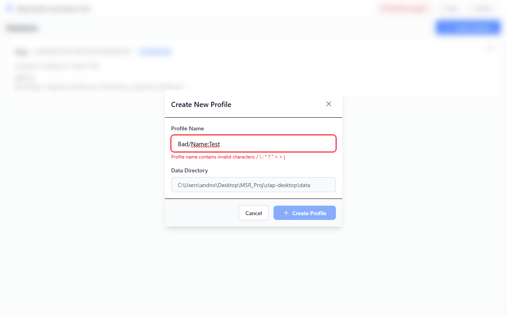

Profiles can't be deleted from inside the app. If you need to remove one, delete its folder from your data directory.

### 4.2 Load the CLAP model

The model status badge in the header doubles as a dropdown:

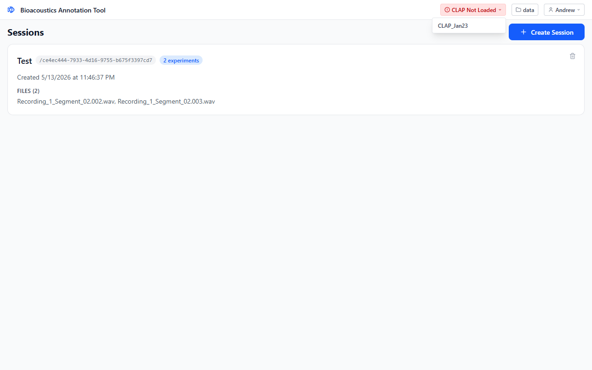

Clicking `CLAP_Jan23` kicks off the load. The badge goes through *Loading…* and then *CLAP_Jan23* in blue:

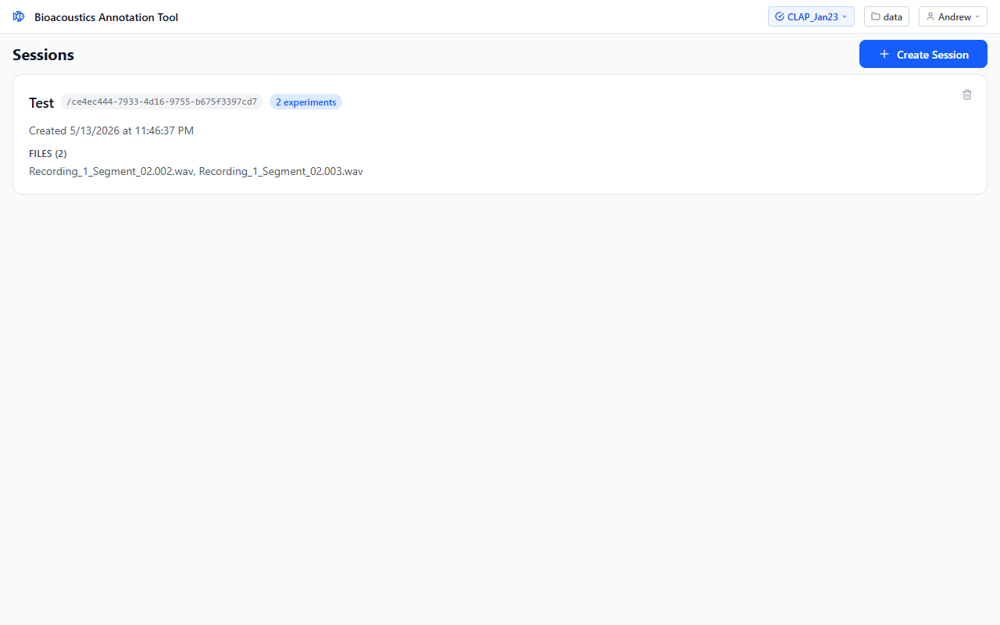

If the model ever crashes mid-session, the app will try to recover automatically. If it can't, the badge goes back to red and you'll see a banner explaining what happened.

Right now `CLAP_Jan23` is the only model included.

### 4.3 Create a session

With a profile selected and the model loaded, click *Create Session*:

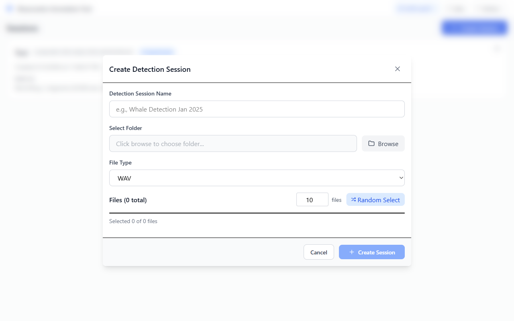

The modal flow:

1. **Detection Session Name.** Optional. If you leave it blank, the session is named with an ISO timestamp like `2026-05-14T11-46-37`. Same character rules as profile names, checked as you type.
2. **Select Folder.** *Browse* opens a folder picker. The app only lets you list audio from folders you've actually opened via Browse, so you can't accidentally point it somewhere weird.
3. **File Type.** Currently WAV only.
4. **Files list.** Every WAV in the chosen folder. Tick individual files, or use *Random Select* (with the N counter) to pick a random subset.

The *Create Session* button stays disabled until you've selected at least one file. A session can hold up to 500 files. For anything bigger than that, split it across multiple sessions.

Once created, the modal closes after a short "Session created successfully" toast. The new session appears at the top of the list (newest first). To delete a session, hover the trash icon on its card and confirm twice.

### 4.4 Run a detection experiment

Click a session card to open it:

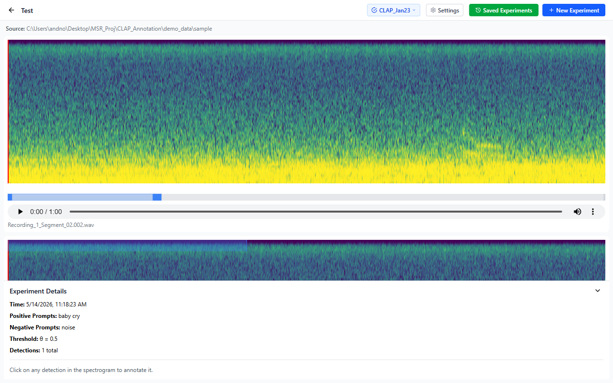

You see:

- **Top.** Source folder, plus one spectrogram block per audio file. Each block shows the filename, an audio playback control, and the spectrogram canvas with detection rectangles laid over the top.
- **Bottom-right.** The experiment / annotation panel. By default it shows *Experiment Details* for the most recent saved experiment.
- **Header.** Settings (per-session), Saved Experiments (sidebar toggle), New Experiment (panel toggle).

To start a fresh experiment, click *New Experiment*:

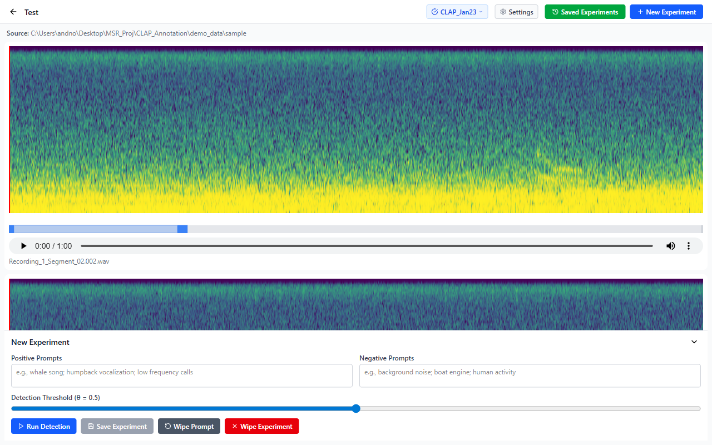

Fill in:

- **Positive Prompts.** Semicolon-separated phrases describing what you want to find ("baby cry; infant vocalization"). Plain English works.
- **Negative Prompts.** Phrases describing what you *don't* want ("noise; static; engine"). These compete with the positives during scoring.
- **Detection Threshold (θ).** A slider from 0.1 to 0.9, which covers what you'll realistically want. Higher θ means fewer, more confident detections. 0.5 is a reasonable starting point.

Then click *Run Detection*. The button turns into a *Running… M:SS (P%)* indicator with an elapsed timer and a *Cancel* button. The prompts and threshold lock while a run is in flight, so you can't accidentally change inputs mid-run.

When the run finishes, the results land in a **temporary experiment**. It's a normal experiment that just hasn't been committed yet. You can review it, click detection rectangles to annotate them, and then either:

- Click **Save Experiment** to commit it as a permanent experiment with a unique ID. It moves to the Saved Experiments sidebar.
- Click **Wipe Experiment** to throw it away. The new-experiment form comes back.

Detections from the temp experiment show up on the spectrograms right away. You don't have to save first to annotate them. Clicking a rectangle opens the annotation panel either way.

If you cancel or the run errors out, you'll see a message at the bottom of the panel.

### 4.5 Read the spectrogram

Each audio file in the session gets its own spectrogram. The view defaults to a 15-second window, which you can change in Settings (`Window Duration`). Scrolling and zooming stay smooth even on long files.

What you'll see:

- **Y axis.** Mel frequency, log-spaced between the configured min and max.
- **X axis.** Time within the visible window.
- **Color.** Energy, normalized to the configured dynamic range and brightness/contrast.
- **Detection rectangles.** Overlays drawn from the experiment's CSV. Each experiment has a fixed color from a palette, and each detection occupies a fixed-height lane (top = lane 0), so when you overlay experiments side by side they line up cleanly.

Interactions on the spectrogram:

- **Click in the spectrogram** to seek and play audio from that point.
- **Scroll wheel** to pan or zoom (configurable in Settings).
- **Navigator bar below the spectrogram** to drag and jump anywhere in the file. The drag area is wider than the visible slider, so you don't have to be pixel-perfect.
- **Click a detection rectangle** to open the annotation panel for that detection (covered in 4.6).

If the spectrogram ever renders blank, that usually means your settings are out of range. Settings catches the common bad combos before letting you save, so check there first.

### 4.6 Annotate and verify detections

Click any rectangle to open the *Detection Annotation* panel:

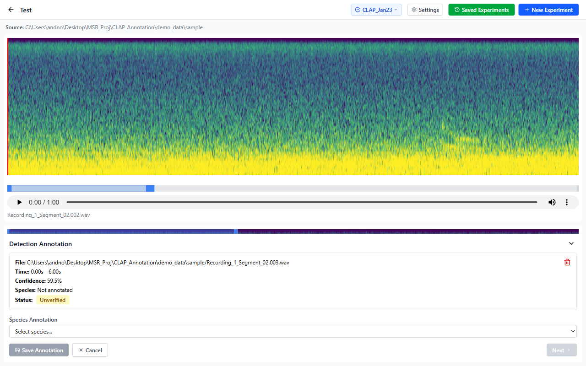

The top half shows read-only metadata:

- **File.** Full path of the audio file.
- **Time.** Start and end in seconds.
- **Confidence.** CLAP's score for this detection, 0 to 100%.
- **Species.** Your annotation, or *Not annotated* if you haven't labeled it yet.
- **Status.** *Unverified* (yellow) or *Verified* (green).

The bottom half is the work area. If the species dropdown is empty, you need to add some entries in Settings first ([4.5](#45-read-the-spectrogram), then *Species List*). Otherwise:

- **Save Annotation.** Writes the selected species to the detection's row in the CSV. The detection stays selected so you can also *Verify* it. Use *Next* to advance.
- **Verify.** Marks the detection green and locks it in. Use this once you've confirmed the call is what you think it is. Verified detections show an *Unverify* button instead, in case you change your mind.
- **Cancel.** Deselects the detection without saving any in-progress species change.
- **Previous / Next.** Step through every detection in the experiment, sorted by file path then start time. Each step (a) scrolls the target file's spectrogram into view, (b) recenters the 15-second viewport on the detection, (c) seeks the audio playhead to the detection's start time, and (d) pauses playback. *Previous* is disabled at the start of the list, *Next* at the end.
- **Delete.** The red trash button in the top-right removes the detection from the CSV. A toast at the bottom of the screen offers a 10-second *Undo*. The last 10 deletions are buffered, so you can undo earlier ones too.

You can **refine the detection bounds** by hovering near the left or right edge of the rectangle until the cursor turns into a resize handle, then dragging. The minimum width is just enough that you can't accidentally collapse the rectangle to nothing, and the edges are clamped to the audio bounds. The CSV updates when you let go.

#### Manually adding a detection at the playhead

If CLAP missed something obvious, or you just want to label a call without running detection at all, you can drop a detection straight onto a spectrogram from the *Experiment Details* panel:

1. Select a saved experiment in the *Saved Experiments* sidebar (the active one is the one showing *Experiment Details* on the right). Manual additions go into that experiment.
2. Play or seek the spectrogram of the audio file you want to mark. Any interaction past time 0 counts: playing, clicking to seek, or dragging the navigator.
3. A blue **`+ Add Detection at Playhead in <filename>`** button appears in the *Experiment Details* panel underneath the metadata.

   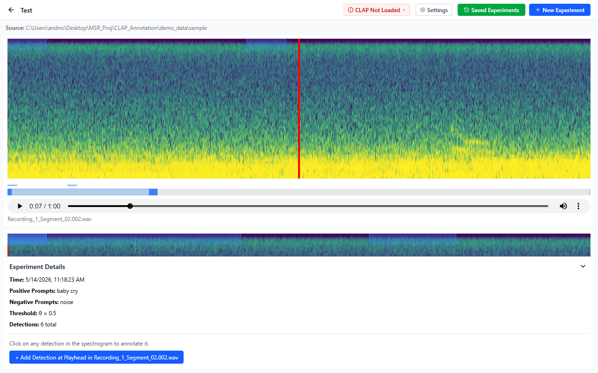

4. Click it. A new 1-second detection is created starting at the current playhead, with confidence 100% (you're the one calling it) and species *Not annotated* until you label it. The annotation panel opens on the new row right away, so you can pick a species, *Verify*, or drag the edges to refine.

   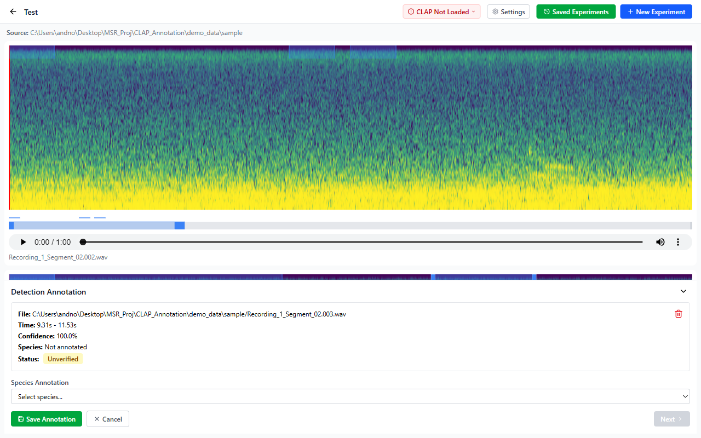

A few details worth knowing:

- The button only shows up once you've actually played or seeked at least one spectrogram in this session. That's how it knows which file you mean. Before any playback, there's no button.
- It targets the *currently active* experiment. To add detections to a different experiment, switch to it in the sidebar first.
- The temp (unsaved) experiment doesn't support manual additions. Save it first if you want to add a row to it. (You'll see the *New Experiment* panel instead of *Experiment Details* while temp is active.)
- The new row is written to the experiment's CSV the moment you click.

### 4.7 Compare experiments

Click *Saved Experiments* in the header to open the right sidebar:

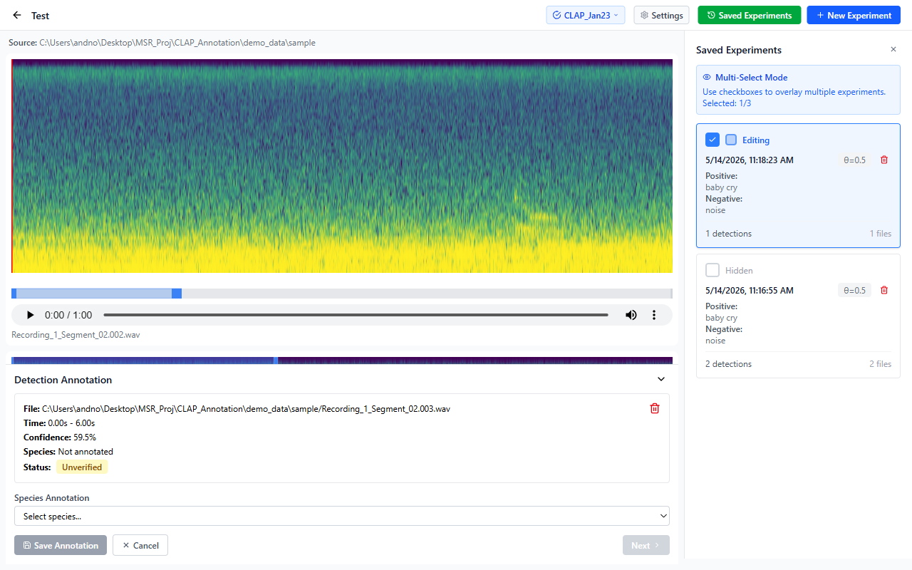

Each saved experiment shows:

- A **color indicator** (the same color the experiment uses for its rectangles).
- Status: *Editing*, *Visible*, or *Hidden*.
- Timestamp, θ, and truncated prompts.
- A detection count.
- A red trash icon for delete (double-confirm).

Tick up to 3 checkboxes at a time. Beyond that, the extra checkboxes go grey until you uncheck one. Each selected experiment gets its own lane on every spectrogram, in the order you selected them (top to bottom). That's how you compare two prompt formulations side by side, or check the overlap between θ=0.4 and θ=0.6 runs on the same data.

Deleting an experiment removes it from the sidebar and from any spectrograms it was on.

---

## Settings reference

Settings are **per-session**. Each session keeps its own copy. Open them from the *Settings* button in the header while inside a session.

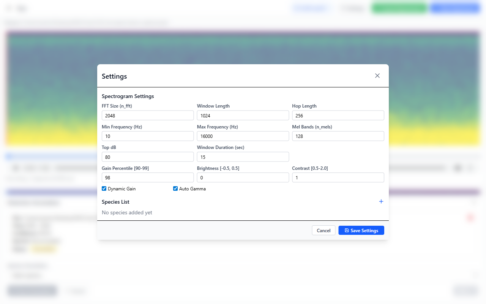

### Spectrogram parameters

| Setting | Range | What it does |
|---|---|---|
| **FFT Size (`n_fft`)** | 128 to 8192, power of 2 | Number of samples per FFT frame. Higher means better frequency resolution, worse time resolution. |
| **Window Length (`win_length`)** | 64 to 8192, ≤ n_fft | Samples used per analysis window. Usually equal to n_fft. |
| **Hop Length (`hop_length`)** | 1 to 4096, ≤ win_length | Samples between consecutive frames. Smaller means a denser X axis. |
| **Min Frequency (`f_min`)** | ≥ 0 Hz | Bottom of the mel filterbank. Use this to crop out subsonic rumble. |
| **Max Frequency (`f_max`)** | > f_min | Top of the mel filterbank. Usually ≤ sample rate / 2. |
| **Mel Bands (`n_mels`)** | 16 to 512 | Y-axis resolution. 128 is a sane default. |
| **Top dB (`top_db`)** | 20 to 120 | Dynamic range for the normalized magnitude. |
| **Window Duration (sec)** | 1 to 120 | How much audio is visible in one spectrogram view. |

### Visualization toggles

| Setting | What it does |
|---|---|
| **Dynamic Gain** | Auto-normalize each window to the chosen *Gain Percentile* (90 to 99). Off means a fixed scale. |
| **Auto Gamma** | Compute a gamma curve from the histogram. Off means a fixed *Gamma* (0.3 to 2.0). |
| **Brightness** | Additive offset on normalized energy, from −0.5 to 0.5. |
| **Contrast** | Multiplicative gain after normalization, from 0.5 to 2.0. |

Out-of-range or conflicting values get flagged inline, and *Save Settings* stays disabled until everything checks out.

### Species List

The same modal hosts your annotation vocabulary. Click `+` to type a species name, press Enter or *Save* to add it, hover a row and click the trash to remove. Names have to be unique.

Species you add here show up in the dropdown in the [annotation panel](#46-annotate-and-verify-detections). They're saved per-session, so different projects can have different vocabularies in the same data directory.

---

## Tips and gotchas

- **A session can hold up to 500 files.** Split larger batches.
- **You can overlay at most 3 experiments at once.** The 4th checkbox in the sidebar goes grey.
- **Undo for deletions lasts about 10 seconds** after you delete a detection, and the last 10 deletions are buffered. After that, deletions are permanent.
- **Detections store absolute audio paths in the CSV.** If you move your data folder to another drive or machine, the session won't find its audio anymore. Keep the data directory stable.
- **Resizing means hitting the edge.** The drag handles are thin, so aim at the very left or right of the rectangle. Clicking in the middle just selects the detection.
- **For batch labeling**, *Save Annotation* keeps the detection selected. Click *Next* to step to the following one.
- **Cancelling a detection takes a moment.** The model finishes the current batch of files before stopping. The *Cancel* button disappears once the cancellation goes through.
- **Settings are per-session.** Changing them in session A doesn't affect session B. New sessions start at default values.

---

## Troubleshooting

| Symptom | Likely cause | Fix |
|---|---|---|
| `CLAP Not Loaded` won't turn blue | Model failed to start | Click the model name again. If it stays red for more than a minute, restart the app. If that doesn't help, the model file may be missing or corrupted, and you should reinstall the app. |
| Detection runs but produces no detections | Prompts too narrow, threshold too high, or the audio doesn't match | Lower θ (try 0.3), broaden the prompts ("low frequency calls" instead of "humpback BWHa-3 song"), and double-check that the audio actually contains what you described. |
| Spectrogram is blank or white | Bad spectrogram settings | Open Settings and look for red borders. Make sure each value is in the range shown in the [Settings reference](#settings-reference). |
| `Directory not authorized` error when listing files | The folder was never opened via *Browse* | Click *Browse* in the relevant modal first. The app tracks which folders you've opened during the session. |
